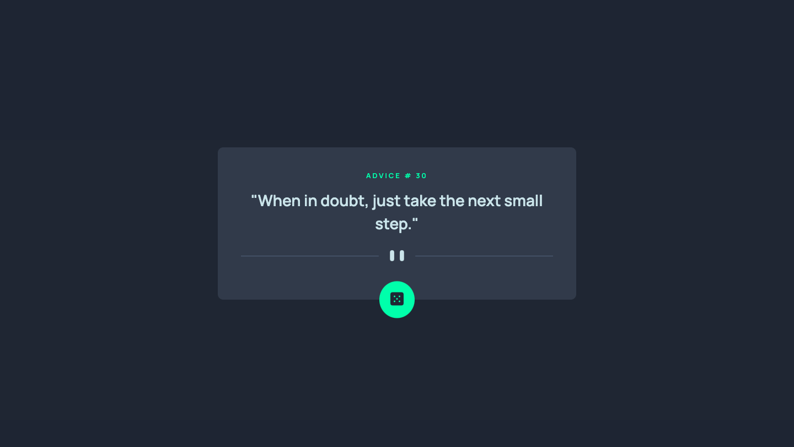

# Frontend Mentor - Advice generator app solution

This is a solution to the [Advice generator app challenge on Frontend Mentor](https://www.frontendmentor.io/challenges/advice-generator-app-QdUG-13db). Frontend Mentor challenges help you improve your coding skills by building realistic projects.

## Table of contents

- [Overview](#overview)
  - [The challenge](#the-challenge)
  - [Screenshot](#screenshot)
  - [Links](#links)
- [My process](#my-process)
  - [Built with](#built-with)
  - [What I learned](#what-i-learned)
  - [Continued development](#continued-development)
  - [Useful resources](#useful-resources)
- [Author](#author)
- [Acknowledgments](#acknowledgments)

**Note: Delete this note and update the table of contents based on what sections you keep.**

## Overview

### The challenge

Users should be able to:

- View the optimal layout for the app depending on their device's screen size
- See hover states for all interactive elements on the page
- Generate a new piece of advice by clicking the dice icon

### Screenshot

### Links

- Solution URL: [Add solution URL here](https://github.com/dthilieu/advice-generator-app)
- Live Site URL: [Add live site URL here](https://dthilieu.github.io/advice-generator-app/)

## My process

### Built with

- Semantic HTML5 markup
- CSS custom properties
- JavaScript
- Mobile-first workflow

### What I learned

- Async function in JavaScript and API interaction

Learn how to use async function to get content from a live API

- CSS mobile-first workflow

Approach building website with mobile-first workflow, then use media query to adjust website on larger screen for easier maintenance and clean, tidy code

- BEM naming convention for CSS

Applied BEM naming convention in class name of CSS for better CSS structruring

- CSS custom properties

Learn to set CSS variables for better maintenance and reusable code in CSS

- Flexbox

Learn to use Flexbox to center elements on the page

### Continued development

Planning on expand current project with more functions such as:

- Change advice API to popular quotes API
- Display quote with image background from image API
- View previous quote
- Like and save current quote on current session
- Option to create custom quote with image background on current session
- Log in session with ability to show saved quotes and custom quotes (if any) for returning customers

### Useful resources

- [Resource 1](https://github.com/MikDra1/adviceGeneratorApp1/tree/main) - This helped me to re-structure my code to be more tidy and clean. I learnt and applied concepts such as CSS mobile-first workflow, BEM, CSS custom properties from this sample solution. Thank you MikDra1!
- [Resource 2](https://chatgpt.com/) - This is an amazing tool helping me to debug my code and advise me with better options.

## Author

Frontend Mentor - [@dthilieu](https://www.frontendmentor.io/profile/dthilieu)

## Acknowledgments

Once again, thank you MikDra1's solution to help me find a better solution to this prolem and show me how to structure code properly, thank you!
